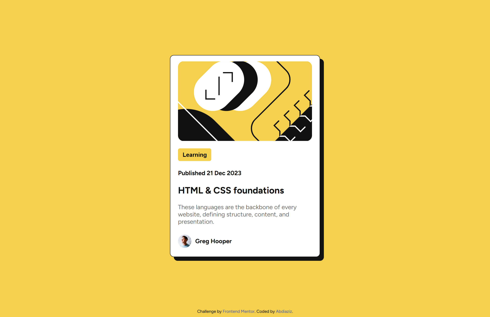

# Frontend Mentor - Blog preview card solution

This is a solution to the [Blog preview card challenge on Frontend Mentor](https://www.frontendmentor.io/challenges/blog-preview-card-ckPaj01IcS). Frontend Mentor challenges help you improve your coding skills by building realistic projects. 

## Table of contents

- [Overview](#overview)
  - [The challenge](#the-challenge)
  - [Screenshot](#screenshot)
  - [Links](#links)
- [Author](#author)

### Screenshot

### Links

- Solution URL: [Add solution URL here](https://github.com/0paziz/blog-preview-card)
- Live Site URL: [Add live site URL here](https://0paziz.github.io/Contact-form/)

## Author

- Website - [Aziz-portfolio](https://0paziz.github.io/Aziz-portfolio/index.html)
- Frontend Mentor - [@0paziz](https://www.frontendmentor.io/profile/@0paziz)
- Linkedin - [abdiaziz-omar](https://www.linkedin.com/in/abdiaziz-omar-876b06256/)
